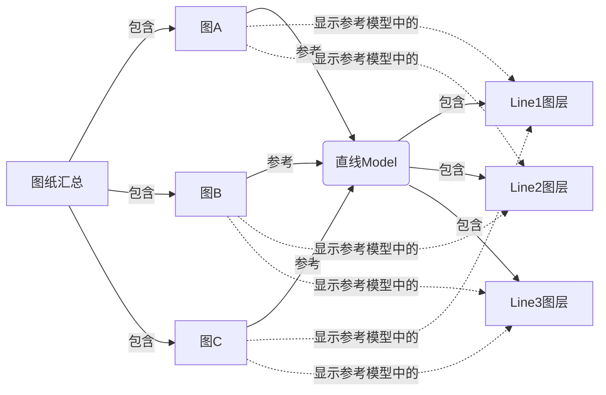

在进行二维出图的时候，我们通常会将几张图纸放到一个 Sheet 中，那么，如何在不同的图纸显示不同的图层组合呢？

<!--more-->
##  问题描述
假设 “图纸汇总" Sheet 中有 3 张图纸，分别是 ”图A“、”图B“ 和 "图C"。
这三张图参考同一个名为 ”直线Model“ 的 Model

”直线“ Model 中有三条线，分别在 "Line1"、”Line2“、”Line3“ 这三个图层中。

现在希望在 "图纸汇总" 中的 "图A" 中显示 "Line1" 和 ”Line2“ 图层，在 ”图B“ 显示 ”Line2“ 和 ”Line3“ 图层，在 ”图C“ 中显示 "Line1" 和 ”Line3“ 图层。
如下图所示：

## 解决方案
1. 打开图纸的 sheet;
2. 选择需要修改的元素，长按右键，在弹出菜单中选择 Active。这个功能的意思是在当前 Model 中激活参考，实现在当前 Model 中对参考进行编辑。

3. 打开图层显示管理器，根据需要，开关不同的图层。

4. 长按右键，在弹出菜单中选择 DeActive 取消激活，便完成了一张图纸的修改。
5. 如果有需要，可以采用上述 2-4 步骤，对所有需要修改的图纸进行操作。

## 效果展示

## 声明
本文首发于[明不知昔](https://noctiflorous.gitee.io/)，转载请注明出处。
